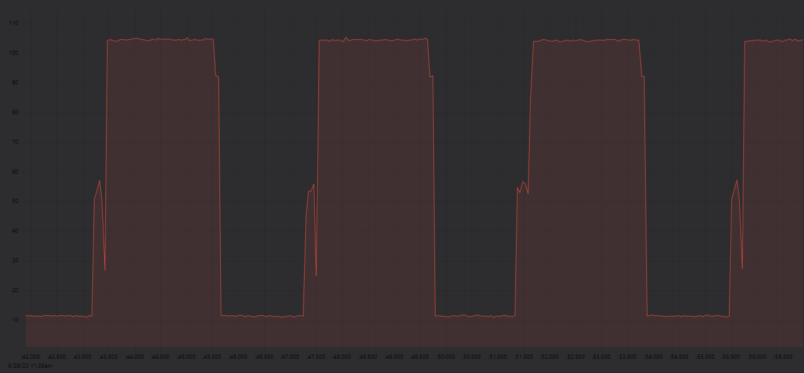
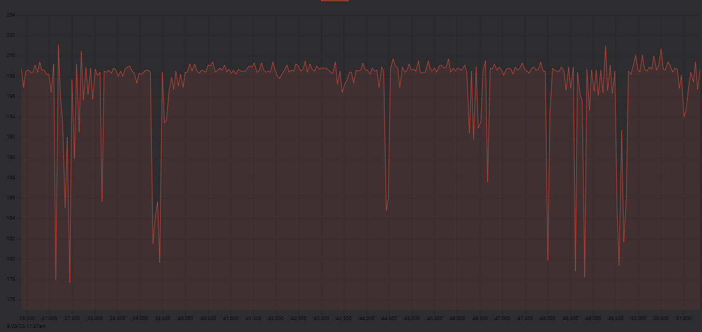
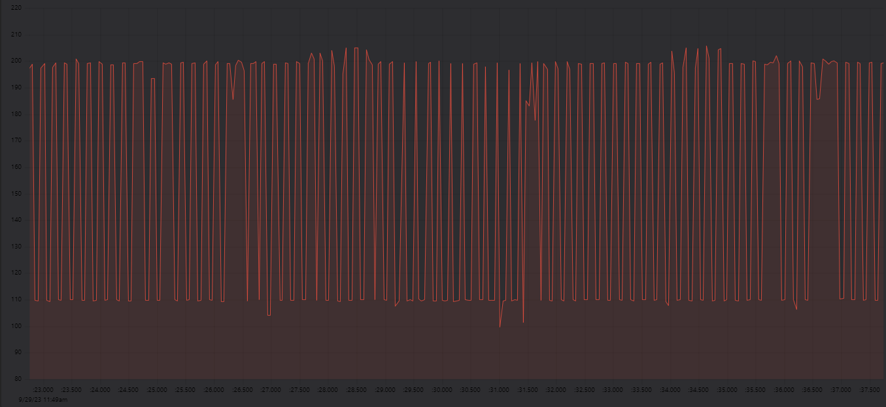

# ESP32-C3 Current Sensing with INA219

Read the current measured by INA219 (Adafruit breakout board) on ESP32-C3 (bare-metal Rust) and print it to be visualized with the Teleplot VSCode extension.
The sensor is connected to two USB breakout boards to measure the current of a connected device.

This is not a professional tool but cheap and better than nothing 🙂

## Examples

ESP32 running code to delaying for 2 seconds, then deep-sleeping for 2 seconds and rebooting

ESP32 running esp-wifi's dhcp example

ESP32 running esp-wifi's dhcp example with `ps-min-modem`

